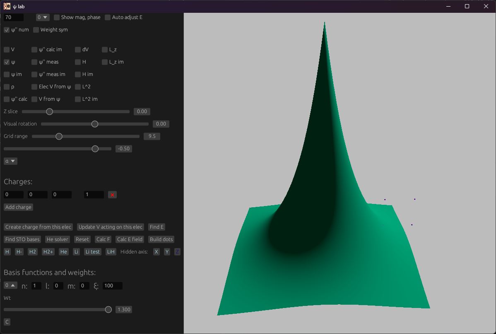

# Graphics
A 3D rendering engine for rust programs, with GUI integration 

[](https://crates.io/crates/graphics)
[](https://docs.rs/graphics)

This library is a framework for building PC applications that have 3D graphics, and an
EGUI user interface. It uses the WGPU toolkit, and Vulkan backend. It works on Windows, Linux, and Mac, but does not
support web.

This is intended as a general-purpose 3D visualization tool. Example use cases including wave-function viewing, n-body simulations, and protein structure visualization. It's also been used to visualize UAS attitude in preflight software.



It currently does not include practical documentation or usage examples.

It includes built in FPS-style (Amplified for 6 DOF) camera controls. (WSAD + Space for up, C for down, Q and E for roll.
Mouse for pitch and yaw). This can be overridden by the application with arbitrary controls. (See the `event_handler` parameter to
`graphics::run()`)

It uses the [lin_alg](https://docs.rs/lin-alg2/latest/lin_alg/f32/index.html) library for vector, matrix, and quaternion operations.

Example boilerplate below. Calling `render(state)` starts an event loop. The application can interact with the engine through the `_handler` callbacks; each frame, each hardware event, or through the GUI. Each of these return an `EngineUpdates` struct, which determines if entities, meshes, lighting, or the camera needs to be refreshed.

```rust
//! This module integrations this application with the graphics engine.

use std::f32::consts::TAU;

use graphics::{
    Camera, ControlScheme, DeviceEvent, EngineUpdates, Entity, InputSettings, LightType, Lighting,
    Mesh, PointLight, Scene, UiLayout, UiSettings,
};
use egui::{Context, Slider, TopBottomPanel};

use lin_alg::f32::{Quaternion, Vec3};

use crate::{playback::change_snapshot, ui::ui_handler, State};

type Color = (f32, f32, f32);

const WINDOW_TITLE: &str = "Causal gravity model";
const WINDOW_SIZE_X: f32 = 1_600.;
const WINDOW_SIZE_Y: f32 = 1_000.;
const BACKGROUND_COLOR: Color = (0.5, 0.5, 0.5);

const RENDER_DIST: f32 = 200.;

pub const BODY_SPHERE_SIZE: f32 = 0.1;
pub const BODY_SHINYNESS: f32 = 2.;
pub const BODY_COLOR: Color = (0., 1.0, 0.5);

/// This runs whenever an event (e.g. keyboard, mouse etc) occurs, and provides information on the event.
fn event_handler(
    _state: &mut State,
    _event: DeviceEvent,
    _scene: &mut Scene,
    _dt: f32,
) -> EngineUpdates {
    EngineUpdates::default()
}

/// This runs each frame.
fn render_handler(_state: &mut State, _scene: &mut Scene, _dt: f32) -> EngineUpdates {
    EngineUpdates::default()
}

const SLIDER_WIDTH: f32 = 460.;
const SLIDER_WIDTH_ORIENTATION: f32 = 100.;

pub const ROW_SPACING: f32 = 22.;
pub const COL_SPACING: f32 = 30.;

/// This function draws the (immediate-mode) GUI.
/// [UI items](https://docs.rs/egui/latest/egui/struct.Ui.html#method.heading)
pub fn ui_handler(state: &mut State, ctx: &Context, scene: &mut Scene) -> EngineUpdates {
    let mut engine_updates = EngineUpdates::default();

    TopBottomPanel::top("0").show(ctx, |ui| {
        ui.spacing_mut().slider_width = SLIDER_WIDTH;

        ui.horizontal(|ui| {
            ui.add_space(COL_SPACING);
            ui.label("Time:");

            let snapshot_prev = state.ui.snapshot_selected;
            ui.add(Slider::new(
                &mut state.ui.snapshot_selected,
                0..=state.snapshots.len() - 1,
            ));

            if state.ui.snapshot_selected != snapshot_prev {
                change_snapshot(
                    &mut scene.entities,
                    &state.snapshots[state.ui.snapshot_selected],
                );

                engine_updates.entities = true;
            }
        });

        ui.add_space(ROW_SPACING / 2.);
    });

    engine_updates
}


/// Entry point to our render and event loop.
pub fn render(state: State) {
    let mut scene = Scene {
        meshes: vec![Mesh::new_sphere(1., 12, 12)],
        entities: Vec::new(), // updated below.
        camera: Camera {
            fov_y: TAU / 8.,
            position: Vec3::new(0., 10., -20.),
            far: RENDER_DIST,
            orientation: Quaternion::from_axis_angle(Vec3::new(1., 0., 0.), TAU / 16.),
            ..Default::default()
        },
        lighting: Lighting {
            ambient_color: [-1., 1., 1., 0.5],
            ambient_intensity: 0.03,
            point_lights: vec![
                // Light from above and to a side.
                PointLight {
                    type_: LightType::Omnidirectional,
                    position: Vec3::new(30., 50., 30.),
                    diffuse_color: [0.3, 0.4, 0.5, 1.],
                    specular_color: [0.3, 0.4, 0.5, 1.],
                    diffuse_intensity: 8_000.,
                    specular_intensity: 30_000.,
                },
            ],
        },
        background_color: BACKGROUND_COLOR,
        window_size: (WINDOW_SIZE_X, WINDOW_SIZE_Y),
        window_title: WINDOW_TITLE.to_owned(),
    };

    let input_settings = InputSettings {
        initial_controls: ControlScheme::FreeCamera,
        ..Default::default()
    };
    let ui_settings = UiSettings {
        layout: UiLayout::Top,
        icon_path: Some("./resources/icon.png".to_owned()),
    };

    // Initialize entities.
    if !state.snapshots.is_empty() {
        change_snapshot(
            &mut scene.entities,
            &state.snapshots[state.ui.snapshot_selected],
        )
    }

    // This starts the main event loop; program intereactions from here on out will 
    // be handled by one of the `_handler` callbacks defined above.
    graphics::run(
        state,
        scene,
        input_settings,
        ui_settings,
        render_handler,
        event_handler,
        ui_handler,
    );
}

struct State {} // Set this up however you'd like.

fn main() {
    render(State {});
}
```